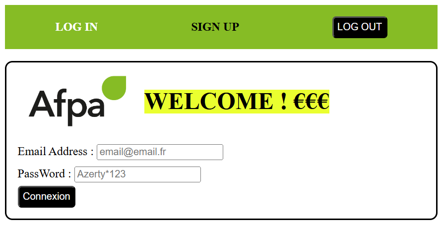

#BACK-END Bank Account Project

# Mise en place d'un ORM

Compétences abordées :
- implémentation d'entités
- configuration d'un projet Spring pour la communication avec une BDD PostgreSQL

# Sécurité

Utilisation de Json Web Token (JWT)
